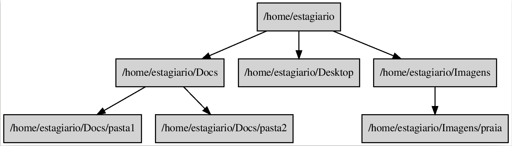
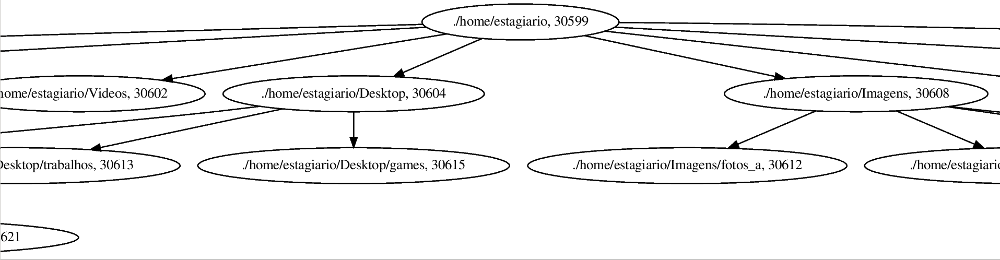

# Trabalho 1 - Sistemas Operacionais A (ELC1080)

-----------

## Motivação:

Imagine que você já se formou e agora é um profissional de uma grande empresa de tecnologia. Como tal, você é um excelente programador que lidera uma equipe. Recentemente, um estagiário se juntou ao seu time de programadores, porém ele ainda é inexperiente e está usando o paradigma POG nos códigos do projeto da empresa.

Um pouco mais sobre POG  :joy::


* Se funciona, então tá certo.
* My Way.
* Murphy ou Lei de Murphy.
* Deixe o amanhã para amanhã.
* Comentários/Documentação são para amadores.
* Eficiência primeiro.
* Fé em Deus
* Ocasião faz o Ladrão.

  - Fonte: https://fernandofranzini.wordpress.com/2012/07/11/pog-programacao-orientada-a-gambiarras/

O seu trabalho como líder de equipe é ensinar ao estagiário como ele deve escrever melhores códigos. Para isso, você separou algumas dicas de programadores famosos para apresentar ao novo integrante do grupo. E então para que ele tenha acesso as dicas, você espalhou as mesmas por todas as pastas do computador do estagiário.

##### Exemplos de dicas:

  - Bjarne Stroustrup, Inventor do C++ e autor do livro The C++ Programming Language:

 > Gosto do meu código elegante e eficiente. A lógica deve ser direta para dificultar o encobrimento de bugs, as dependências mínimas para facilitar a manuntenção, o tratamento de erro completo de acordo com uma estratégia clara e o desempenho próximo do mais eficiente de modo a não incitar as pessoas a tornarem o código confuso com otimizações sorrateiras. O código limpo faz vem apenas uma coisa.

 -  Grady Booch, autor do livro Object Oriented Analysis and Design with Applications:

 > Um código limpo é simples e direto. Ele é tão bem legível quanto uma prosa bem escrita. Ele jamais torna confuso o objetivo de desenvolvedor, em vez disso, ele está repleto de abstrações claras e linhas de controle objetivas.

 - Fonte: Livro Clean Code de Robert C. Martin.

------------------------

## Descrição do trabalho.

1. Crie um arquivo chamado [banco_de_dicas.txt](banco_de_dicas.txt) com algumas dicas de programadores famosos. Sinta-se livre para adicionar dicas de autores da sua preferência (Ex.: Autor da sua linguagem de programação preferida, autor de uma ferramenta importante, etc.).

2. Crie um programa em C que a partir da pasta `/home/estagiario` irá criar arquivos com as dicas de programadores para todas as pastas e subpastas do sistema. O arquivo deve se chamar dica_do_dia.txt e nele deve conter uma das dicas do arquivo [banco_de_dicas.txt](banco_de_dicas.txt). Seja criativo na definição de um algoritmo para sortear a dica. As dicas podem se repetir.

3. **O programa deve usar a função `fork()`**. A cada nível da árvore de arquivos você deve realizar **N** *forks* para cada pasta. Para o exemplo abaixo: o programa deve executar 3 *forks* para o nível `/home/estagiario`, 2 *forks* para o nível `/home/estagiario/Docs` e 1 *fork* para o nível `/home/etagiario/Imagens`. **Dica: Funções recursivas são elegantes e eficientes.** [Aqui](http://man7.org/linux/man-pages/man2/fork.2.html) você encontrará mais detalhes sobre a função `fork()`.



4. Utilize a função `wait()` para garantir que o processo pai (raiz da árvore) espere por todos os processos filhos terminarem suas tarefas. [Aqui](http://man7.org/linux/man-pages/man2/waitpid.2.html) você encontrará mais detalhes sobre a função `wait()`.

5. Utilize esse exemplo de pastas e subpastas: [/home/estagiario](/home/estagiario).

6. Utilize a biblioteca **dirent.h** para navegar pelas pastas.

```c
#include <stdio.h>
#include <sys/types.h>
#include <dirent.h>

// Here’s a simple program that prints the names of the files in the current working directory:

int main (void)
{
  DIR *dp;
  struct dirent *ep;

  dp = opendir ("./");
  if (dp != NULL)
    {
      while (ep = readdir (dp))
        puts (ep->d_name);
      (void) closedir (dp);
    }
  else
    perror ("Couldn't open the directory");

  return 0;
}

// Fonte: https://www.gnu.org/software/libc/manual/html_node/Simple-Directory-Lister.html
```

7. A saída do seu programa deve seguir o formato `\t <PAI pid> -> <FILHO pid>;`. Para obter os pid's dos processos pai e filho, utilize as funções `getppid()` e `getpid()`. [Aqui](http://man7.org/linux/man-pages/man2/getpid.2.html) você encontrará mais detalhes sobre as funções `getppid()` e `getpid()`. Ainda, cada pid deve receber um nome (label), esse nome deve seguir o formato: `<pid> [label="<caminho da pasta onde o processo criou um arquivo de dica>, <pid>"]`. Perceba que a ordem não tem significância, você pode mostrar a label antes do `\t <PAI pid> -> <FILHO pid>;` ou ao contrário. A primeira linha da saída deve ser: `digraph G {`, e a última deve ser: `}`.

Exemplo de saída:

```
digraph G {
	30599 [label="./home/estagiario, 30599"];
	30599 -> 30600;
	30600 [label="./home/estagiario/Music, 30600"];
	30599 -> 30601;
	30601 [label="./home/estagiario/Documentos, 30601"];
	30599 -> 30602;
	30602 [label="./home/estagiario/Videos, 30602"];
	30601 -> 30606;
	30606 [label="./home/estagiario/Documentos/regras, 30606"];
	30599 -> 30604;
	30604 [label="./home/estagiario/Desktop, 30604"];
	30599 -> 30608;
	30608 [label="./home/estagiario/Imagens, 30608"];
	30599 -> 30603;
	30603 [label="./home/estagiario/Modelos, 30603"];
	30599 -> 30607;
	30607 [label="./home/estagiario/Downloads, 30607"];
	30599 -> 30610;
	30610 [label="./home/estagiario/Pictures, 30610"];
	30601 -> 30609;
	30609 [label="./home/estagiario/Documentos/2019_files, 30609"];
	30604 -> 30611;
	30611 [label="./home/estagiario/Desktop/codigos_empresa, 30611"];
	30608 -> 30612;
	30612 [label="./home/estagiario/Imagens/fotos_a, 30612"];
	30604 -> 30613;
	30613 [label="./home/estagiario/Desktop/trabalhos, 30613"];
	30604 -> 30615;
	30615 [label="./home/estagiario/Desktop/games, 30615"];
	30608 -> 30614;
	30614 [label="./home/estagiario/Imagens/fotos_d, 30614"];
	30608 -> 30618;
	30601 -> 30605;
	30618 [label="./home/estagiario/Imagens/fotos_b, 30618"];
	30605 [label="./home/estagiario/Documentos/2018_files, 30605"];
	30608 -> 30619;
	30619 [label="./home/estagiario/Imagens/fotos_c, 30619"];
	30607 -> 30617;
	30617 [label="./home/estagiario/Downloads/lib_b, 30617"];
	30607 -> 30616;
	30616 [label="./home/estagiario/Downloads/lib_a, 30616"];
	30611 -> 30620;
	30620 [label="./home/estagiario/Desktop/codigos_empresa/proj2, 30620"];
	30611 -> 30621;
	30621 [label="./home/estagiario/Desktop/codigos_empresa/proj1, 30621"];
}
```
8. O seu código deve ser comentado, descrevendo os passos do programa.

#### Caso você queria visualizar a saída do seu programa de forma gráfica:

* Instale o [Graphviz](https://graphviz.gitlab.io/) - um software de visualização de gráficos de código aberto. Execute o comando `sudo apt-get install graphviz` para instalação.
* Salve a saída do seu programa em um arquivo chamado saida.gv .
* Execute o comando `dot -Tps saida.gv -o saida.ps`
* Abra o arquivo saida.ps.

.
